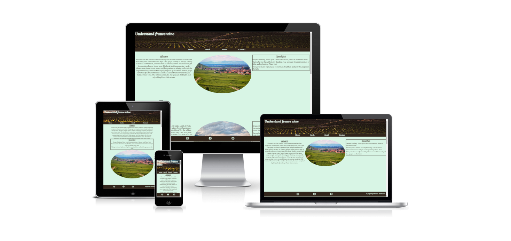
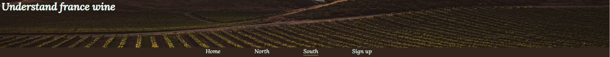
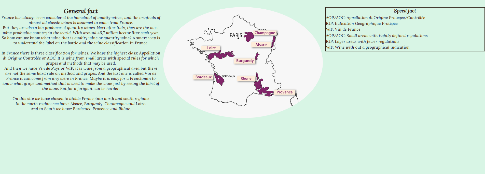
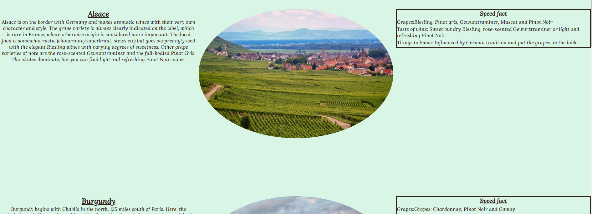
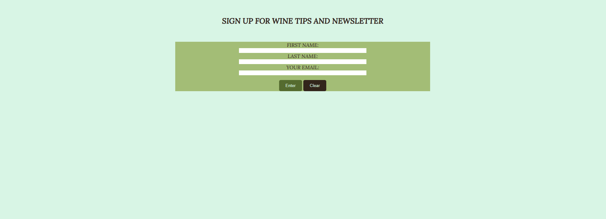
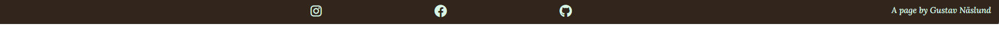

# Understanding the label

The understanding the label page is a page there the visitors to learn about the French wine regions and what kind of grapes you can expect to find in this regions. This can me a jungel sometimes and hard do understand the labels. So the page is for those how want to learn about french wine in an easy way and there are speed fact if you dont want to read the whole fact text.  

## Features

### Existing Features

#### Navigation menu and header img

On all pages you can see the header image and a navigation menu, it looks the same on all pages so the user will not get confused. Through the navigation menu you can 
go to all the diffrent pages on the site without the use of the browser navigation buttons. The page you are on is underline in the menu. 

#### General fact

Here you can read about french wine laws, classification of wine and general fact about french wine. You can also see a map over the 7 biggest wineregions in France. 

#### The north and south

This a two pages that works the same. You can read some fact about diffrent wine regions in France, we have split them up in north and south. In the north you can read about Alsace, Burgundy, Champagne and Loire. And in the south you can read about Bordeaux, Provence and Rhône. You can also se a picture from the diffrent wine regions, except Champange were there is a film instead. Far to the right of the two pages there is a speed fact box, where you can read about the grapes and the taste of the wine from each region. 

#### Sign up

On this page you can sign up for newsletter and wine tips. 

#### The Footer

Here you can find links to social media where you can connect to more groups about wine and see pictures. All the links opens in a new tab for easy navigation. You can also see who made the site. 

### Features Left to Implement 
In the future i want to implement a interactiv map. 
It will also be more fact about the regions, maybe every region will have there own page with photo gallery

## Testing
I have tried the site in Chrome and Microsoft edge and it worked the same in both browsers.

I confirmed that my site is responsiv through the use of devtools in chrome. And i tried the site on my phone. 

I confirmed that the links in the footer opens in a new tab and that they not are broken links.

I confirmed that the form works as i should you need to write a email in the email box and the submit button works. 
I used the code institute form dump page to see that the right values were sent. 

## Validator Testing
### HTML
No errors were returned when passing through the official W3C validator
### CSS
No errors were found when passing through the official (Jigsaw) validator
### Accessibility

Deployment
This section should describe the process you went through to deploy the project to a hosting platform (e.g. GitHub)

The site was deployed to GitHub pages. The steps to deploy are as follows:
In the GitHub repository, navigate to the Settings tab
From the source section drop-down menu, select the Master Branch
Once the master branch has been selected, the page will be automatically refreshed with a detailed ribbon display to indicate the successful deployment.
The live link can be found here - https://code-institute-org.github.io/love-running-2.0/index.html

Credits
In this section you need to reference where you got your content, media and extra help from. It is common practice to use code from other repositories and tutorials, however, it is important to be very specific about these sources to avoid plagiarism.

You can break the credits section up into Content and Media, depending on what you have included in your project.

<h2>Content</h2>
Fact text came from Forbes and Systembolaget
The icons in the footer were taken from Font Awesome
<h2>Media</h2>
The photos and video came from <a src="https://pixabay.com/"> and <a src="https://www.pexels.com">

